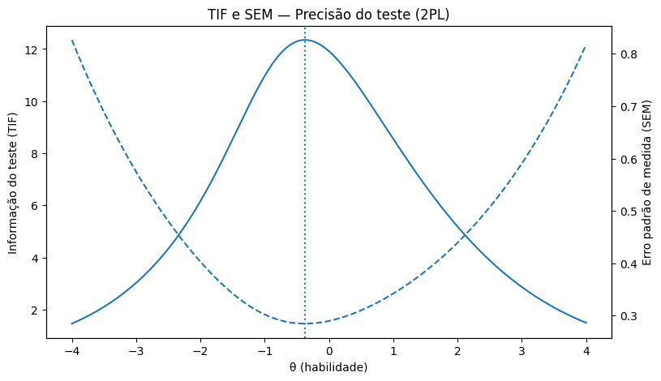
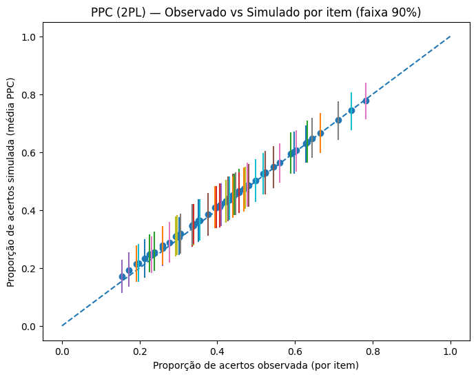
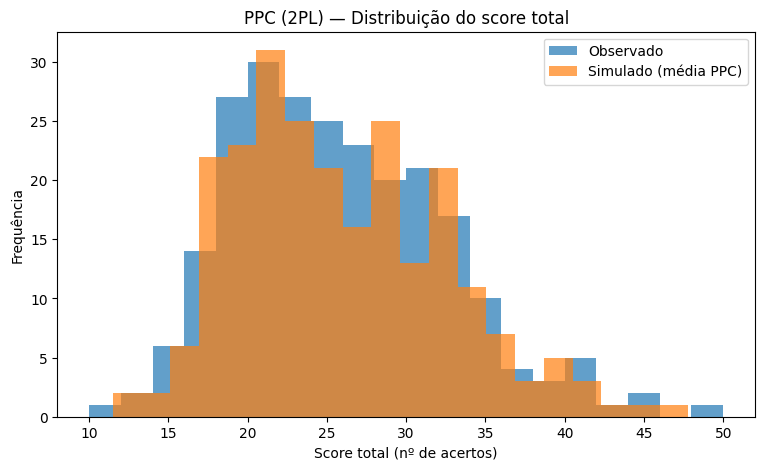
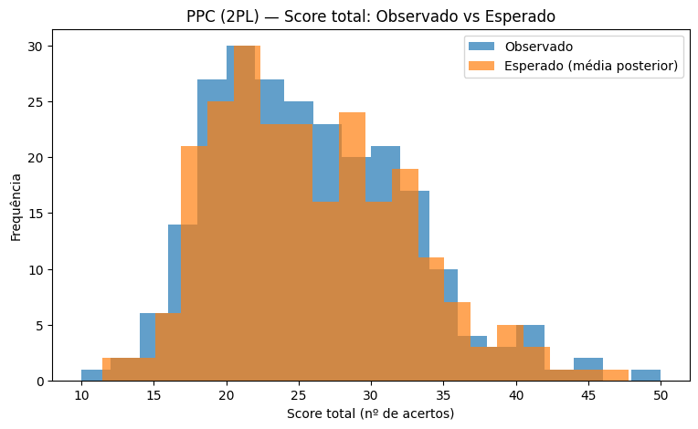
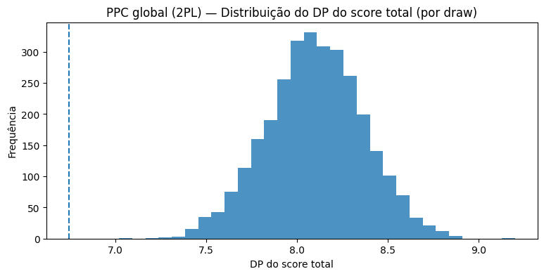
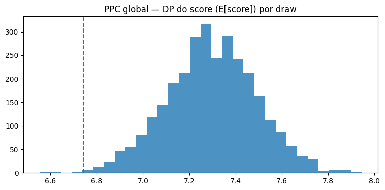
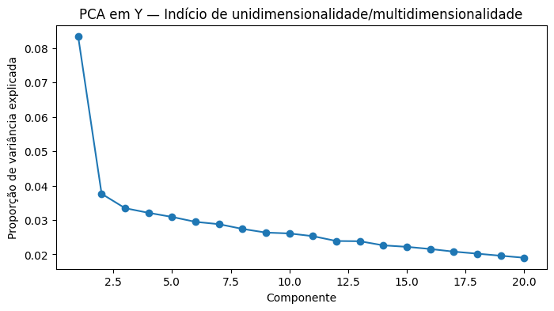
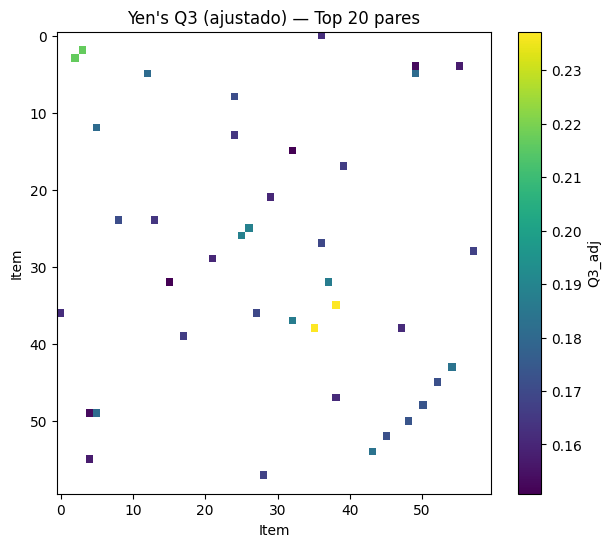
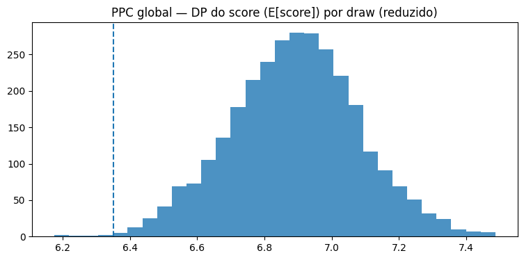

# 📊 Teoria de Resposta ao Item (TRI) — Calibração Bayesiana


## 📌 Introdução

Aplicação de **Teoria de Resposta ao Item (TRI)** a um instrumento dicotômico com 239 respondentes e 60 itens, comparando os modelos **Rasch (1PL)** e **2PL** via inferência bayesiana completa em PyMC.

O projeto cobre calibração, comparação de modelos por LOO, análise de precisão (TIF/SEM), validação por Posterior Predictive Checks e diagnóstico de pressupostos (PCA + Yen's Q3).

## 🔑 Resultados principais

| Métrica | Valor | Interpretação |
|---|---|---|
| N respondentes | 239 | — |
| J itens | 60 | — |
| Taxa média de acerto | 0,422 | Dificuldade moderada |
| **Δelpd LOO (2PL − Rasch)** | **86,97** | 2PL muito superior |
| Peso 2PL (BB-pseudo-BMA) | 1,000 | 2PL domina completamente |
| Pico TIF | θ ≈ −0,37 | Maior precisão em hab. baixa-média |
| TIF no pico | 12,35 | Precisão elevada |
| SEM no pico | 0,285 | Erro padrão baixo |
| PPC itens fora do envelope 90% | **0 de 60** | Ajuste local excelente |
| Pares Q3 ≥ 0,20 | 2 | Dependência local pontual |
| PPC global (média/DP) | ❌ Ambos fora | Indício de multidimensionalidade |

## 📊 Visualizações

### Precisão do Teste

| TIF e SEM — Precisão (2PL) |
|---|
|  |

### Posterior Predictive Check — Nível do Item

| Envelope Preditivo | PPC Detalhado | PPC Recomendado |
|---|---|---|
|  |  |  |

### Posterior Predictive Check — Nível Global

| Score Total | E[Score] Esperado |
|---|---|
|  |  |

### Diagnóstico de Pressupostos

| PCA — Dimensionalidade | Yen's Q3 — Dependência Local | ICC — Curvas dos Itens |
|---|---|---|
|  |  |  |

## 🧠 Metodologia

```
Etapa 1 → Calibração: Rasch (1PL) e 2PL via PyMC + NUTS
Etapa 2 → Comparação: LOO com BB-pseudo-BMA
Etapa 3 → Precisão: TIF e SEM por faixa de habilidade
Etapa 4 → Validação PPC: nível do item (0/60 fora do envelope)
Etapa 5 → Validação PPC: nível global (média e DP do score total)
Etapa 6 → Diagnóstico: PCA (dimensionalidade) + Yen's Q3 (dependência local)
```

## 🏗️ Arquitetura dos modelos

```
Rasch (1PL):  P(Y=1|θ,b)   = σ(θ_p − b_i)
2PL:          P(Y=1|θ,a,b) = σ(a_i(θ_p − b_i))

Priors:
  θ ~ Normal(0, 1)          — traço latente
  b ~ Normal(0, 1) centrado — dificuldade
  a ~ LogNormal(0, 0.30)    — discriminação (prior firme)

Amostrador: NUTS | 2 chains | target_accept=0.92
```

## 📄 Documentação

- `documentacao/TRI_Documentacao_Tecnica.pdf` — sumário técnico com tabelas de resultados
- `artigo/TRI_Artigo_Tecnico.md` — artigo completo com introdução, metodologia, resultados e discussão

## ⚠️ Principal achado e próximos passos

O 2PL calibra bem **localmente** (item a item) mas o score total observado fica fora do envelope PPC — evidência compatível com **multidimensionalidade**. A PCA reforça essa hipótese ao não revelar fator dominante.

**Próximos passos sugeridos:**
- Modelo **MIRT** (Multidimensional IRT) para estimar traços por domínio
- Modelo **bifator** se a hipótese for traço geral + subfatores ortogonais

## 🛠️ Stack

- **Modelagem:** PyMC 5, ArviZ
- **Análise:** pandas, NumPy, SciPy, scikit-learn
- **Visualização:** matplotlib
- **Ambiente:** Google Colab / Jupyter

## ▶️ Como executar

```bash
pip install pymc arviz pandas numpy matplotlib scipy scikit-learn
```

Execute o notebook: `notebooks/TRI_Teoria_de_Resposta_ao_Item.ipynb`

Não requer dataset externo — os dados são gerados/carregados no próprio notebook.

## 🔗 Projetos relacionados

- [Inferência Bayesiana Aplicada — A/B Testing](https://github.com/gilsonmm6/bayesian-ab-marketing)
- [Aprendizado por Reforço — DPI/MARL](https://github.com/gilsonmm6/iterated-prisoners-dilemma-marl)
- [Análise de Fairness — COMPAS](https://github.com/gilsonmm6/compas-fairness-analysis)

## 👤 Autor

**Gilson Machado Monteiro**  
Data Analyst & BI Analyst | Especialização em Estatística Aplicada (PUC Minas)  
[LinkedIn](https://linkedin.com/in/gilsonmachadomonteiro) · [GitHub](https://github.com/gilsonmm6)
